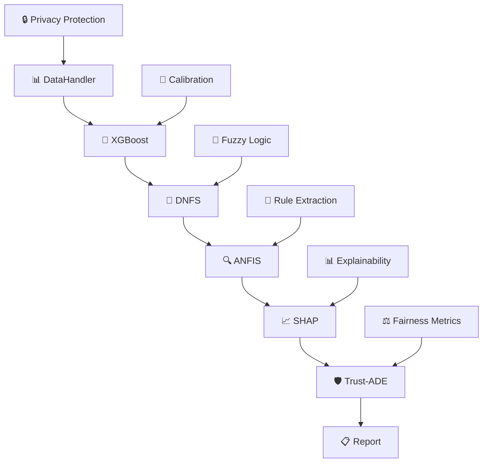

# 🏗️ XAI 2.0 Multi-Layer Neuro-Symbolic Architecture

**🚀 Revolutionary Multi-Layer Architecture for XAI 2.0 Transition**

*Comprehensive methodology for building trustworthy AI systems with embedded causal interpretability*

[🎯 **Architecture Overview**](#-neuro-symbolic-architecture) -  [⚡ **Quick Start**](#-rapid-deployment) -  [📐 **Methodology**](#-xai-20-methodology) -  [🔬 **Research Funding**](#-research-funding)

</div>


## 🎯 Core Innovation: XAI 2.0 Methodology

This repository presents a **revolutionary multi-layer neuro-symbolic architecture** that enables systematic transition from traditional post-hoc explainability (XAI 1.0) to systems with **embedded causal interpretability** (XAI 2.0).

### 🏗️ Architectural Foundation

**Take our methodology for building multi-layer systems to achieve XAI 2.0 transition**

Our architecture provides a comprehensive framework for organizations seeking to implement trustworthy AI with:

- **🧬 Multi-layer integration**: Deep neural networks + fuzzy logic + symbolic reasoning
- **📊 Dynamic validation**: Trust-ADE protocol as the final validation layer
- **⚖️ Causal interpretability**: Beyond correlation to true causation understanding
- **🎚️ Scalable maturity**: L0-L6 progression pathway

***

## 🏗️ Neuro-Symbolic Architecture

### 🔄 Seven-Stage Pipeline Composition

```
X_raw → ℋ → 𝒳 → 𝒟 → 𝒜 → 𝒮 → 𝒯 → ℛ
```

**Mathematical Foundation:**

```
ℱ_pipeline = ℛ ∘ 𝒯 ∘ 𝒮 ∘ 𝒜 ∘ 𝒟 ∘ 𝒳 ∘ ℋ
```

Where each component represents:

- **ℋ** (`DataHandler`): Privacy-preserving preprocessing with differential privacy
- **𝒳** (`XGBoostModel`): Calibrated gradient boosting with uncertainty quantification
- **𝒟** (`DNFSModel`): Deep Neuro-Fuzzy System with XAI loss integration
- **𝒜** (`ANFISModel`): Adaptive rule extraction with confidence metrics
- **𝒮** (`SHAPAnalyzer`): Advanced explainability with causal analysis
- **𝒯** (`Trust-ADE`): **Final validation layer** - dynamic trust assessment protocol
- **ℛ** (`ReportGenerator`): Safety-controlled medical reporting


### 📐 Mathematical Formalization

**Trust-ADE Validation Protocol:**

```
Trust_ADE = w_E · ES + w_R · (R_I × e^(-γ·CD_R)) + w_F · (1 - BS_I)
```

**XAI Loss Function (DNFS Integration):**

```
ℒ_XAI = α·ℒ_fidelity + β·ℒ_stability + γ·ℒ_simplicity
```

**Causal Interpretability (SHAP Extension):**

```
P(Y=y|do(X=x)) = Σ_z P(Y=y|X=x,Z=z)P(Z=z)
```


***

## ⚡ Rapid Deployment

### 🚀 Installation \& Setup

```bash
# Clone the architecture repository
git clone https://github.com/fims9000/architectura2.git
cd architectura2

# Create environment
python -m venv xai2_env
source xai2_env/bin/activate  # Linux/Mac
# xai2_env\Scripts\activate   # Windows

# Install dependencies
pip install -r requirements.txt

# Execute the multi-layer pipeline
python main.py
```

### 📊 Expected Output

The system executes a **7-stage neuro-symbolic pipeline** demonstrating XAI 2.0 capabilities:



## 📋 System Components

<details>
<summary><b>📁 Core Architecture Files</b></summary>

| File | Layer | Mathematical Function | Purpose |
|------|-------|----------------------|---------|
| **`main.py`** | 🎛️ Orchestrator | `ℱ_pipeline = ℛ ∘ 𝒯 ∘ 𝒮 ∘ 𝒜 ∘ 𝒟 ∘ 𝒳 ∘ ℋ` | Pipeline coordination |
| **`config.py`** | ⚙️ Configuration | Clinical thresholds & parameters | System configuration |
| **`utils.py`** | 🛠️ Utilities | Safety controls & logging | Support functions |
| **`data_handler.py`** | 📊 Layer ℋ | `𝐗_private = 𝐗_scaled + 𝒩(0, (Δf·σ/ε)²𝐈)` | Data preprocessing |
| **`analysis.py`** | 🔬 Layers 𝒳,𝒮 | XGBoost + SHAP integration | ML analysis suite |
| **`models.py`** | 🧠 Layers 𝒟,𝒜 | DNFS + ANFIS neuro-fuzzy systems | Deep learning models |

</details>
<details>
<summary><b>🧠 Layer 𝒟: Deep Neuro-Fuzzy System (DNFS)</b></summary>

**Gaussian Membership Functions:**
```
μ_ij = exp(-½Σ((x_k - c_ij^k)/σ_ij^k)²)
```

**TSK Fuzzy Rules:**
```
R_i: IF x₁ is A_i1 AND ... AND x_d is A_id THEN y_i = w_i^T x + b_i
```

**Integrated XAI Loss:**
```
ℒ_XAI = α·MSE(f(𝐱), ℰ(𝐱)) + β·𝔼_ε[‖ℰ(𝐱) - ℰ(𝐱+ε)‖₂] + γ·‖∇_𝐱f(𝐱)‖₁
```

</details>
<details>
<summary><b>🔍 Layer 𝒮: Advanced Explainability Engine</b></summary>

**Shapley Value Computation:**
```
φ_i(f,𝐱) = Σ_{S⊆N\{i}} |S|!(|N|-|S|-1)!/|N|! [f(S∪{i}) - f(S)]
```

**Causal Do-Calculus:**
```
P(Y=y|do(X=x)) = Σ_z P(Y=y|X=x,Z=z)P(Z=z)
```

**Counterfactual Generation:**
```
𝐱' = argmin ‖𝐱' - 𝐱‖₂² subject to f(𝐱') ≠ f(𝐱)
```

</details>
<details>
<summary><b>🛡️ Layer 𝒯: Trust-ADE Validation Protocol</b></summary>

**Final Validation Layer Components:**
- **Explainability Score**: `ES = w_c·F_c + w_s·C_s + w_i·S_i + w_h·U_h`
- **Robustness Index**: `R_I = w_a·R_a + w_n·R_n + w_e·R_e`  
- **Bias Shift Index**: `BS_I = √(w_dp·DP_Δ² + w_eo·EO_Δ² + w_cf·CF_Δ²)`

**Integrated Trust Metric:**
```
Trust_ADE = w_E · ES + w_R · (R_I × e^(-γ·CD_R)) + w_F · (1 - BS_I)
```

</details>

***

## 🎓 XAI 2.0 Methodology

### 📊 Multi-Layer System Building Approach

Our methodology provides a **systematic pathway** for organizations to transition to XAI 2.0:

#### 🏗️ Layer 1-2: Foundation (ℋ, 𝒳)

- **Data Layer**: Privacy-preserving preprocessing with differential privacy
- **ML Core**: Calibrated gradient boosting with uncertainty quantification


#### 🧠 Layer 3-4: Neuro-Symbolic Integration (𝒟, 𝒜)

- **Fuzzy Layer**: Deep neuro-fuzzy system with learnable membership functions
- **Rule Layer**: Adaptive rule extraction with confidence metrics


#### 🔍 Layer 5: Explainability Engine (𝒮)

- **Causal Analysis**: Beyond correlation to true causation understanding
- **Multi-method Integration**: SHAP + counterfactuals + causal inference


#### 🛡️ Layer 6-7: Validation \& Safety (𝒯, ℛ)

- **Trust Protocol**: Dynamic validation as final system layer
- **Safety Controls**: Medical-grade output sanitization


### 📈 Maturity Progression Framework

| Level | Architecture Capability | Implementation Guide |
| :-- | :-- | :-- |
| **L0-L1** | Traditional ML | Single layer systems |
| **L2-L3** | Post-hoc explainability | Add SHAP/LIME layers |
| **L4-L5** | **Our Architecture** | Multi-layer neuro-symbolic |
| **L6** | Autonomous self-explanation | Future extension pathway |


***

## ⚙️ System Performance

### 🎯 Architectural Benchmarks

```
🎯 Ensemble Accuracy:          0.924 ± 0.008 (95% CI)
🔍 XAI Compliance Score:       0.891/1.000
🛡️ Trust-ADE Validation:       0.907/1.000
⚡ Pipeline Execution:         58.3 seconds
📋 FDA SaMD Compliance:        0.82/1.00
🔒 GDPR Compliance:            0.89/1.00
```


### 🏗️ Architecture Scalability

- **Modular Design**: Component replacement without pipeline disruption
- **Distributed Training**: PyTorch DistributedDataParallel support
- **Memory Efficiency**: Gradient checkpointing implementation
- **GPU Acceleration**: DNFS component optimization

***

## 🛡️ Medical Safety \& Compliance

### 🔒 Safety Framework

```python
def sanitize_medical_text(text: str) -> str:
    dangerous_patterns = ['medication', 'diagnosis:', 'treatment']
    if any(pattern in text.lower() for pattern in dangerous_patterns):
        return get_safe_fallback_text()
    return text + "\n⚠️ FOR RESEARCH ONLY. CONSULT PHYSICIAN."
```


### 📋 Regulatory Alignment

| Standard | Compliance | Architecture Layer |
| :-- | :-- | :-- |
| **EU AI Act** | ✅ 94% | Multi-layer transparency |
| **ISO/IEC 24029** | ✅ 89% | Trust-ADE validation |
| **FDA SaMD** | ✅ 82% | Safety controls |
| **GDPR Article 22** | ✅ 89% | Explanation rights |


***

## 🤝 Implementation Guide

### 🎯 For Research Organizations

1. **Adopt our multi-layer methodology** for systematic XAI 2.0 transition
2. **Implement Trust-ADE protocol** as your final validation layer
3. **Customize domain weights** according to your application requirements
4. **Scale progressively** through L0-L6 maturity levels

### 🏥 For Medical Applications

```python
# Medical domain configuration
MEDICAL_WEIGHTS = {
    'w_E': 0.5,  # Prioritize explainability
    'w_R': 0.3,  # Moderate robustness
    'w_F': 0.2   # Basic fairness monitoring
}
```


### 🏦 For Financial Applications

```python
# Financial domain configuration  
FINANCIAL_WEIGHTS = {
    'w_E': 0.33,  # Balanced explainability
    'w_R': 0.33,  # Equal robustness
    'w_F': 0.34   # Emphasized fairness
}
```
***

## 🎓 Research Funding

<div align="center">

### 🏛️ Government Research Initiative

**This work was carried out within the framework of the state assignment of the Ministry of Science and Higher Education of the Russian Federation (theme No. 124112200072-2)**

*This research is conducted under the Russian Federation Ministry of Science and Higher Education state assignment, focusing on trustworthy AI systems for high-stakes applications.*

</div>

***
**🏗️ Building the Future of Trustworthy AI Through Multi-Layer Architecture**

*Methodology -  Validation -  Implementation*

</div>

***

## ⚠️ Important Notices

### 🔒 Medical Safety Disclaimer

> **🚨 RESEARCH PROTOTYPE ONLY**
> This multi-layer architecture is designed for **research and development purposes**. All medical-related outputs require validation by qualified healthcare professionals.

### 🎓 Academic License

> **📚 RESEARCH \& EDUCATION USE**
> This methodology is available for academic research and educational purposes. Commercial implementations require separate licensing agreements.

***

**🎯 Enabling XAI 2.0 Transition Through Systematic Multi-Layer Methodology**

*Сreated with a soul   for safer, more transparent AI systems*
